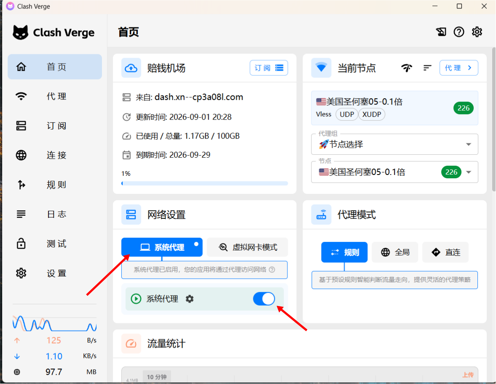
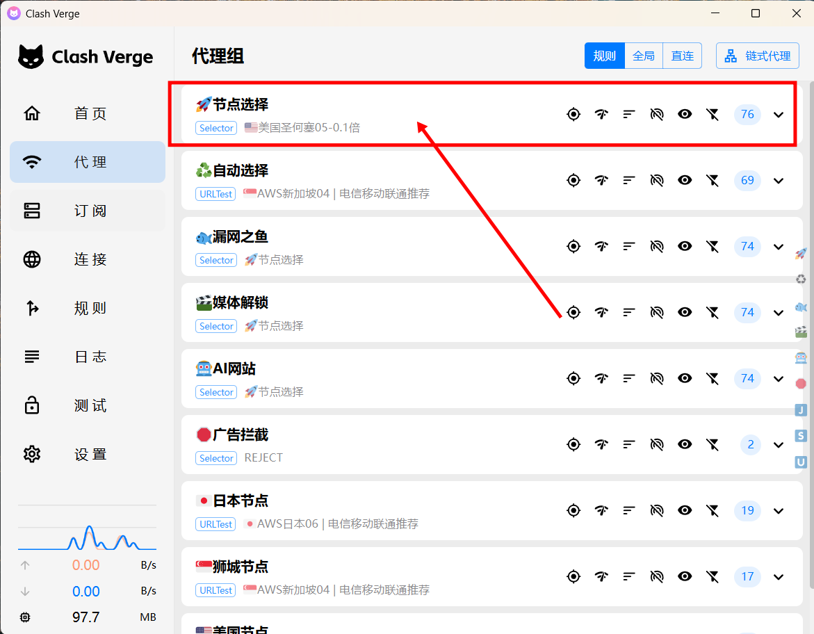
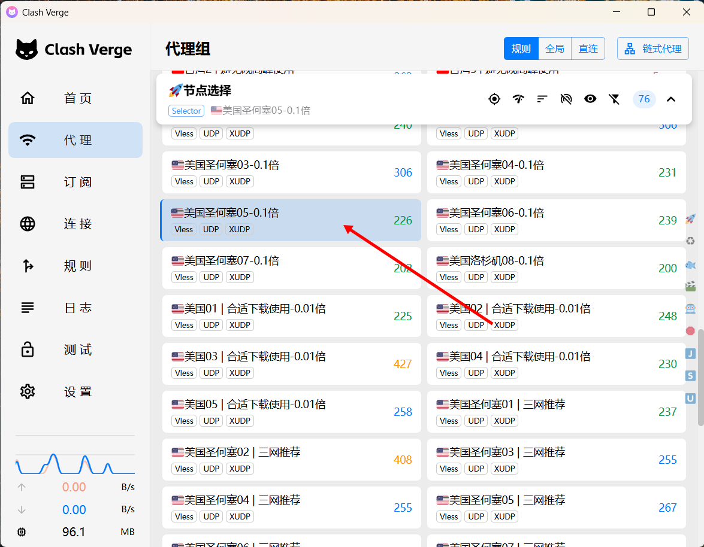
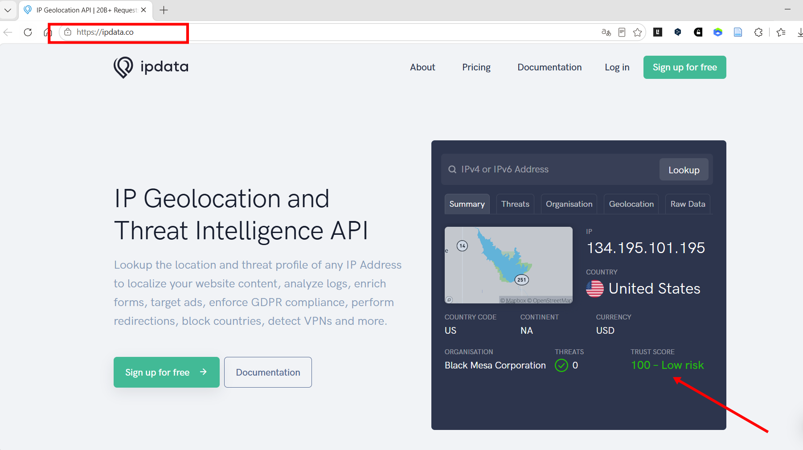
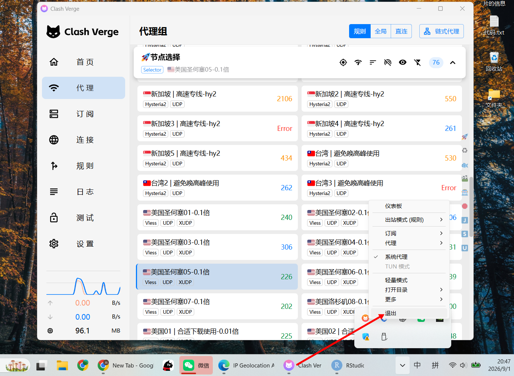

```{r setup, include=FALSE}
knitr::opts_chunk$set(
  echo = FALSE,      # 不显示代码
  warning = FALSE,
  message = FALSE,
  fig.align = "center",
  out.extra = "",
  dpi = 300,
  dev = "png"
)
```

```{r green-text, echo=FALSE, results='asis'}
# 让 **文字**（即 <strong>）显示为绿色
# 一级标题(<h1>)：黑色加粗；二级/三级标题(<h2>/<h3>)：黑色
# 分割横线(<hr>)：黑色
cat('<style>
  strong { color: #228b22; }
  h1 { color: #000; font-weight: bold; }
  h2, h3 { color: #000; }
  hr { border: 0; border-top: 2px solid #000; }
</style>\n')
```

# 概述

Clash Verge 是一款基于 Clash 内核的图形化代理客户端，支持 Windows、macOS 和 Linux。
本指南按操作步骤对应下面的截图，帮助你完成软件安装与基本配置。

> **提示：每次退出只需要从托盘退出，不需要关闭系统代理，以便下次打开软件可以直接使用**

# 使用说明

## 第一步

**图 1 说明：只需要保持系统代理打开即可**
```{r img1, fig.cap="图 1：主界面"}

```


---

## 第二步

**图 2 说明：进行节点选择**
```{r img2, fig.cap="图 2：代理节点"}

```


---

## 第三步

**图 3 说明：寻找延迟较低的节点。优先选择美国节点（部分地区的Chatgpt、Geminibu进行开放）**
```{r img3, fig.cap="图 3：代理节点选择"}

```


---

## 第四步

**图 4 说明：部分网站或者软件会进行IP纯净度检测。所以，在选择节点后，要访问网站`https://ipdata.co`进行纯净度检测，如果不是low—risk，保险起见则需要重新选择节点**
```{r img4, fig.cap="图 4：ip检测"}

```


---

## 第五步

**图 5 说明：直接在电脑托盘点击Clash Verge退出即可。**
```{r img5, fig.cap="图 5：退出方式"}

```


---

# 常见问题及注意事项

- 启动vpn后，在访问外网或特殊需求的软件时，请先登录`https://ipdata.co`进行纯净度检测，如果不是low—risk，保险起见则需要重新选择节点。
- 若无法连接，请检查是否选择了正确的节点。
- 若浏览器无法访问，请确认系统代理已开启；若代理开启后，站点延迟检测都很低，请尝试连接手机热点。
- 非特殊情况不要开启虚拟网卡模式（即全局模式），容易造成路由混乱。

---

